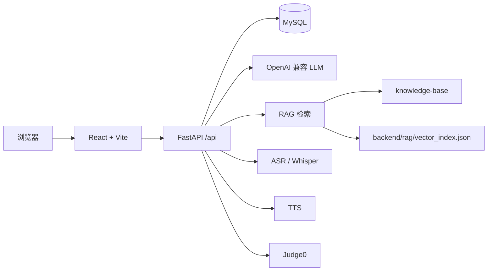

# InterviewEcho

InterviewEcho 是一个 AI 模拟面试与能力提升平台，面向计算机相关专业学生和求职者。项目把岗位面试、简历深挖、GitHub 项目追问、表达分析、面试报告和代码练习整合成一条训练闭环。

## 核心功能

- 岗位模拟面试：支持 Java 后端、Web 前端、Python 算法等岗位方向。
- 个性化配置：可设置难度、轮次、考察领域、简历深挖轮次、GitHub 项目深挖轮次。
- AI 面试官：基于 OpenAI 兼容接口生成问题、追问、总结和报告。
- 结构化调度：使用 `round_index`、`question_id`、`parent_question_id`、`action`、`source` 管理主问题、追问和结束状态。
- 简历资料：支持简历文本编辑、PDF 上传、AI 摘要、技能标签和一键清除。
- GitHub 项目深挖：分析项目 README、语言、关键词，并生成项目相关面试题。
- 语音能力：支持语音转写、表达指标分析和 TTS 播放。
- 面试报告：输出总分、维度评分、表达分析、简历匹配、项目复盘和四周提升路线。
- 代码练习：Hot200 题库、ACM 输入输出、Python/Java/C++/JavaScript 四语言提交、Judge0 判题。

## 技术栈

| 层级 | 技术 |
| --- | --- |
| 前端 | React 18、Vite、React Router、Axios、ECharts、CodeMirror、Lucide React |
| 后端 | FastAPI、SQLAlchemy、Pydantic、Uvicorn |
| 数据库 | MySQL 8 |
| AI | OpenAI 兼容接口、RAG、Embedding |
| 语音 | FFmpeg、DashScope ASR、Whisper、MiMo TTS |
| 判题 | Judge0 CE |

## 架构概览



## 目录结构

```text
InterviewEcho/
  backend/
    core/          配置、LLM、Prompt、岗位标准
    db/            数据模型、Schema、题库 seed
    routers/       API 路由
    services/      RAG、GitHub 分析、语音、TTS、Judge0
    rag/           RAG 索引构建
    evaluation/    表达分析规则
    sql/           初始化和迁移 SQL
    tests/         调度相关测试
    main.py        FastAPI 入口
  frontend/
    src/           React 页面、组件、API 客户端和样式
    package.json   前端依赖
  knowledge-base/  岗位知识库和 Prompt 资料
  docs/            项目说明和本地运行文档
  scripts/         部署辅助脚本
  .env.example     后端环境变量示例
```

## 部署前准备

本地或服务器需要安装：

- Git
- Node.js 20 或更新版本
- Python 3.12 或兼容版本
- MySQL 8.x
- FFmpeg，语音上传和转码需要
- Judge0 CE，可选，仅代码运行和提交需要

Windows 推荐使用 PowerShell；macOS / Linux 推荐使用 bash 或 zsh。

## 快速本地部署

### 1. 拉取代码

```bash
git clone <你的仓库地址> InterviewEcho
cd InterviewEcho
```

如果已经有代码：

```bash
git pull
```

### 2. 初始化 MySQL

确保 MySQL 已启动，然后在项目根目录执行 SQL。

Windows PowerShell：

```powershell
$env:MYSQL_PWD="你的MySQL密码"
Get-Content -Raw -Encoding UTF8 backend\sql\init_db.sql | mysql --default-character-set=utf8mb4 -u root
Get-Content -Raw -Encoding UTF8 backend\sql\migration_v2_voice.sql | mysql --default-character-set=utf8mb4 -u root
Get-Content -Raw -Encoding UTF8 backend\sql\migration_v3_github.sql | mysql --default-character-set=utf8mb4 -u root
Get-Content -Raw -Encoding UTF8 backend\sql\migration_v4_code_practice.sql | mysql --default-character-set=utf8mb4 -u root
Get-Content -Raw -Encoding UTF8 backend\sql\migration_v5_message_state.sql | mysql --default-character-set=utf8mb4 -u root
Remove-Item Env:\MYSQL_PWD -ErrorAction SilentlyContinue
```

macOS / Linux：

```bash
export MYSQL_PWD='你的MySQL密码'
mysql --default-character-set=utf8mb4 -u root < backend/sql/init_db.sql
mysql --default-character-set=utf8mb4 -u root < backend/sql/migration_v2_voice.sql
mysql --default-character-set=utf8mb4 -u root < backend/sql/migration_v3_github.sql
mysql --default-character-set=utf8mb4 -u root < backend/sql/migration_v4_code_practice.sql
mysql --default-character-set=utf8mb4 -u root < backend/sql/migration_v5_message_state.sql
unset MYSQL_PWD
```

验证：

```bash
mysql --default-character-set=utf8mb4 -u root -e "USE interview_echo; SHOW TABLES;"
```

### 3. 配置后端环境变量

复制环境变量模板：

Windows PowerShell：

```powershell
cd backend
Copy-Item ..\.env.example .env
```

macOS / Linux：

```bash
cd backend
cp ../.env.example .env
```

编辑 `backend/.env`，至少检查这些配置：

```env
APP_HOST=127.0.0.1
APP_PORT=8000

DB_HOST=localhost
DB_PORT=3306
DB_USER=root
DB_PASS=你的MySQL密码
DB_PASSWORD=你的MySQL密码
DB_NAME=interview_echo

CORS_ORIGINS=http://localhost:5173,http://127.0.0.1:5173

LLM_API_KEY=你的模型服务Key
LLM_BASE_URL=https://your-provider/v1
LLM_MODEL=你的对话模型
EMBEDDING_MODEL=你的向量模型

WHISPER_PRELOAD=false

ASR_PROVIDER=dashscope
ASR_API_KEY=

MIMO_API_KEY=
MIMO_BASE_URL=https://api.xiaomimimo.com/v1
MIMO_TTS_MODEL=mimo-v2.5-tts

JUDGE0_BASE_URL=http://127.0.0.1:2358
```

注意：

- `backend/.env` 不能提交到 Git。
- `LLM_BASE_URL` 必须是 OpenAI 兼容接口地址，通常以 `/v1` 结尾。
- `ASR_API_KEY` 为空时，代码会尝试复用 `LLM_API_KEY`。
- 不配置 `MIMO_API_KEY` 时，TTS 不可用，但文字面试不受影响。
- 不启动 Judge0 时，代码运行和提交不可用，但面试功能不受影响。

### 4. 安装并启动后端

Windows PowerShell：

```powershell
cd backend
py -3.12 -m venv .venv
.\.venv\Scripts\Activate.ps1
python -m pip install --upgrade pip setuptools wheel
pip install -r requirements.txt
uvicorn main:app --reload --host 127.0.0.1 --port 8000
```

macOS / Linux：

```bash
cd backend
python3.12 -m venv .venv || python3 -m venv .venv
source .venv/bin/activate
python -m pip install --upgrade pip setuptools wheel
pip install -r requirements.txt
uvicorn main:app --reload --host 127.0.0.1 --port 8000
```

验证后端：

```bash
curl http://127.0.0.1:8000/
curl http://127.0.0.1:8000/api/interview/roles
```

正常情况下根接口返回：

```json
{"message":"Welcome to InterviewEcho API"}
```

### 5. 构建 RAG 索引

RAG 索引会读取 `knowledge-base/`，生成 `backend/rag/vector_index.json`。

前提：

- `backend/.env` 中已配置 `LLM_API_KEY`
- `LLM_BASE_URL` 和 `EMBEDDING_MODEL` 与模型服务商兼容

执行：

Windows PowerShell：

```powershell
cd backend
.\.venv\Scripts\Activate.ps1
python -m rag.build_index
```

macOS / Linux：

```bash
cd backend
source .venv/bin/activate
python -m rag.build_index
```

如果跳过这一步，后端仍可启动，但 RAG 增强效果不可用。

### 6. 配置并启动前端

打开新终端，从项目根目录执行：

```bash
cd frontend
npm install
```

配置本地 API 地址。

Windows PowerShell：

```powershell
"VITE_API_URL=http://127.0.0.1:8000/api" | Set-Content -Encoding UTF8 .env.local
```

macOS / Linux：

```bash
printf "VITE_API_URL=http://127.0.0.1:8000/api\n" > .env.local
```

启动前端：

```bash
npm run dev -- --host 127.0.0.1 --port 5173
```

浏览器访问：

```text
http://127.0.0.1:5173/
```

## 生产部署参考

生产部署常见方式是：

1. 后端使用 Python 虚拟环境安装依赖。
2. 使用 `uvicorn` 或 systemd 管理 FastAPI 服务。
3. 前端执行 `npm run build` 生成 `frontend/dist`。
4. 使用 Nginx 托管前端静态文件。
5. Nginx 将 `/api` 反向代理到后端服务。
6. MySQL、Judge0、上传目录、语音目录放在服务器稳定路径。

### 后端生产启动示例

```bash
cd /srv/interviewecho/backend
source .venv/bin/activate
uvicorn main:app --host 127.0.0.1 --port 8000
```

如果使用 systemd，可以把上面的命令写入 service，由系统托管重启和日志。

### 前端生产构建

```bash
cd frontend
npm install
npm run build
```

构建产物在：

```text
frontend/dist
```

### Nginx 反向代理示例

```nginx
server {
    listen 80;
    server_name your-domain.com;

    root /srv/interviewecho/frontend/dist;
    index index.html;

    location / {
        try_files $uri $uri/ /index.html;
    }

    location /api/ {
        proxy_pass http://127.0.0.1:8000/api/;
        proxy_http_version 1.1;
        proxy_set_header Host $host;
        proxy_set_header X-Real-IP $remote_addr;
        proxy_set_header X-Forwarded-For $proxy_add_x_forwarded_for;
        proxy_set_header X-Forwarded-Proto $scheme;
    }
}
```

生产环境不要把真实 `.env`、API Key、数据库密码提交到仓库。

## 可选服务

### Judge0

代码练习的运行和提交依赖 Judge0。

后端默认读取：

```env
JUDGE0_BASE_URL=http://127.0.0.1:2358
```

验证：

```bash
curl http://127.0.0.1:2358/system_info
```

如果不可用，代码模块会提示判题服务不可用。

### 语音识别

项目支持 DashScope ASR 和本地 Whisper。

本地开发建议：

```env
WHISPER_PRELOAD=false
```

这样可以避免后端启动时预加载 Whisper 模型过慢。

### TTS

TTS 使用 MiMo 接口：

```env
MIMO_API_KEY=你的MiMo Key
MIMO_BASE_URL=https://api.xiaomimimo.com/v1
MIMO_TTS_MODEL=mimo-v2.5-tts
```

未配置时只影响语音播放，不影响文字面试。

## 常用命令

后端：

```bash
cd backend
source .venv/bin/activate
uvicorn main:app --reload --host 127.0.0.1 --port 8000
```

Windows 后端：

```powershell
cd backend
.\.venv\Scripts\Activate.ps1
uvicorn main:app --reload --host 127.0.0.1 --port 8000
```

前端：

```bash
cd frontend
npm run dev -- --host 127.0.0.1 --port 5173
```

前端构建：

```bash
cd frontend
npm run build
```

基础测试：

```bash
python backend/tests/test_interview_planning.py
PYTHONPATH=backend python backend/tests/test_skip_detection.py
```

Windows 基础测试：

```powershell
python backend\tests\test_interview_planning.py
$env:PYTHONPATH=(Resolve-Path backend).Path
python backend\tests\test_skip_detection.py
Remove-Item Env:\PYTHONPATH -ErrorAction SilentlyContinue
```

## 不要提交的内容

这些内容不应该提交到 Git：

```text
.env
backend/.env
frontend/.env
frontend/.env.local
frontend/node_modules/
frontend/dist/
backend/.venv/
backend/__pycache__/
backend/rag/vector_index.json
backend/rag/chroma_db/
uploads/
logs/
*.log
*.wav
*.mp3
*.webm
```

`.env.example` 可以提交，用来说明需要哪些配置项，但不要放真实密钥。

## 相关文档

- `docs/project-overview.md`：项目说明、架构设计、模块划分和数据模型。
- `docs/local-development.md`：更详细的 Windows/macOS/Linux 本地运行教程。
- `docs/expression_module_contract.md`：表达分析模块说明。
- `docs/workflow.md`：旧版工作流说明，部分内容可能和当前 React 版本有差异。
