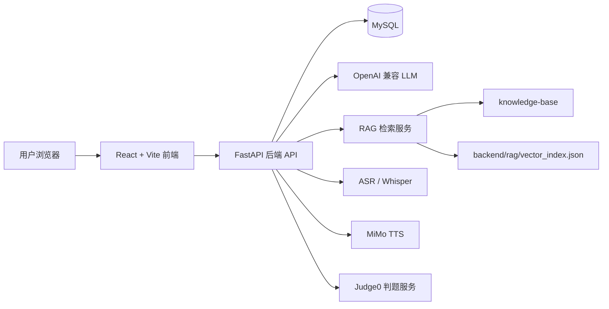
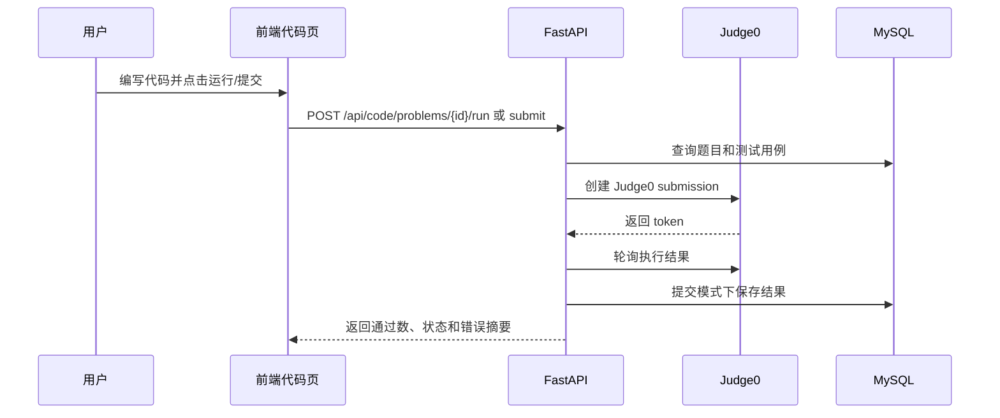

# InterviewEcho 项目说明文档

## 1. 项目定位

InterviewEcho 是一个面向计算机相关专业学生和求职者的 AI 模拟面试与能力提升平台。项目目标不是只完成一次问答式模拟面试，而是把“面试前资料准备、面试中多轮追问、面试后能力评估、后续代码训练”串成一个完整闭环。

平台当前覆盖四类核心能力：

- 模拟面试：按岗位、难度、考察领域和轮次生成面试流程。
- 个性化深挖：结合简历资料和 GitHub 项目生成定制问题。
- 复盘报告：输出总分、维度评分、表达分析、简历匹配、项目复盘和学习建议。
- 代码练习：提供 Hot200 题库、ACM 输入输出、多语言提交和 Judge0 判题。

## 2. 技术栈

| 层级 | 技术选型 | 说明 |
| --- | --- | --- |
| 前端 | React 18、Vite、React Router、Axios | 单页应用，负责面试流程、报告展示、代码练习和个人中心 |
| UI 与图表 | CSS、Lucide React、ECharts、CodeMirror | 实现统一视觉、图表报告和在线代码编辑 |
| 后端 | FastAPI、SQLAlchemy、Pydantic | 提供 REST API、SSE 流式回复、业务编排和数据访问 |
| 数据库 | MySQL | 存储用户、简历、项目、面试、消息、报告、题库和提交记录 |
| AI 接口 | OpenAI 兼容接口 | 支持接入 DashScope、DeepSeek、OpenAI 兼容服务等 |
| RAG | Markdown 知识库 + 本地向量索引 | 从 `knowledge-base/` 构建岗位知识检索能力 |
| 语音 | FFmpeg、Whisper、DashScope ASR、MiMo TTS | 支持语音转写、表达分析和面试官语音播放 |
| 判题 | Judge0 CE | 隔离执行用户代码，返回样例运行和正式提交结果 |

## 3. 整体架构

系统采用前后端分离架构。前端通过统一 API 客户端访问后端，后端负责用户鉴权、面试状态调度、AI 调用、报告生成、RAG 检索、语音处理和判题服务编排。



主要设计思路：

- 前端只负责交互和展示，不直接接触模型密钥和数据库。
- 后端集中处理所有 AI 相关逻辑，保证 Prompt、RAG、追问控制和报告格式统一。
- 面试调度不只依赖消息文本，而是通过结构化字段记录每条消息的轮次、题目身份、动作和来源。
- Judge0、TTS、ASR 都是可选外部能力，未配置时不影响基础文字面试流程。

## 4. 前端设计

前端入口位于 `frontend/src/App.jsx`，API 客户端位于 `frontend/src/api/index.js`。

### 4.1 路由结构

| 路由 | 页面 | 说明 |
| --- | --- | --- |
| `/` | 首页 | 项目入口和产品介绍 |
| `/login` | 登录注册 | 本地账号登录和注册 |
| `/dashboard` | 岗位选择 | 选择 Java 后端、Web 前端、Python 算法等岗位 |
| `/interview/:role` | 面试房间 | 面试设置、对话、语音输入、TTS 播放、结束面试 |
| `/report/:id` | 报告页 | 展示评分、表达分析、轮次复盘和学习路线 |
| `/account` | 个人中心 | 管理简历资料和 GitHub 项目库 |
| `/profile` | 能力历史 | 查看历史面试记录和能力变化 |
| `/code` | 代码练习列表 | 浏览 Hot200 题库 |
| `/code/problems/:problemId` | 代码题详情 | 查看题面、编辑代码、运行样例和正式提交 |

### 4.2 前端状态与交互

- 鉴权状态保存在 `localStorage`，通过 Axios 请求拦截器自动带上 `Authorization`。
- 面试开始前支持配置难度、总轮次、考察领域、简历深挖轮次和 GitHub 项目深挖轮次。
- 面试中支持文本回答、语音回答、AI 流式回复、TTS 播放和结束提示。
- 报告页使用 ECharts 展示雷达图、历史趋势和表达分析图表。
- 代码练习页使用 CodeMirror 提供多语言编辑体验。

## 5. 后端设计

后端入口位于 `backend/main.py`。启动时会注册四组路由：

| 路由模块 | 前缀 | 职责 |
| --- | --- | --- |
| `routers/auth.py` | `/api/auth` | 注册、登录、Token 认证 |
| `routers/interview.py` | `/api/interview` | 岗位、面试开始、消息、语音、TTS、报告、历史 |
| `routers/profile.py` | `/api/profile` | 简历、PDF 上传、GitHub 项目库 |
| `routers/code.py` | `/api/code` | 题库、样例运行、正式提交、提交历史 |

后端分层如下：

```text
backend/
  core/        配置、LLM 调用、Prompt、岗位评分标准
  db/          SQLAlchemy 模型、Pydantic Schema、题库 seed
  routers/     FastAPI 路由层
  services/    RAG、GitHub 分析、语音、TTS、Judge0 等业务服务
  rag/         RAG 索引构建和索引文件
  evaluation/  表达分析与评估规则
  sql/         初始化 SQL 和迁移脚本
  tests/       面试调度与跳过检测测试
```

## 6. 数据模型设计

核心表由 `backend/db/models.py` 定义。

| 表 | 作用 |
| --- | --- |
| `users` | 用户账号和密码哈希 |
| `user_profiles` | 用户简历、摘要、技能、教育、经历和项目文本 |
| `user_projects` | 用户保存的 GitHub 项目信息和分析摘要 |
| `questions` | 岗位题库问题 |
| `interviews` | 一次面试会话，记录岗位、难度、轮次、状态、项目上下文 |
| `messages` | 面试消息，记录候选人回答、AI 提问、追问和结束提示 |
| `evaluations` | 面试报告，包括总分、分项分、表达子分和完整 JSON 报告 |
| `voice_metrics` | 单条语音回答的声学和语言特征 |
| `code_problems` | Hot200 题库题面 |
| `code_test_cases` | 代码题样例和隐藏测试用例 |
| `code_submissions` | 用户代码提交记录和判题结果 |

### 6.1 面试消息结构化字段

`messages` 表不仅保存文本，还保存以下调度字段：

| 字段 | 作用 |
| --- | --- |
| `round_index` | 当前主问题属于第几轮 |
| `question_id` | 当前问题的稳定 ID，用于去重和定位 |
| `parent_question_id` | 追问对应的主问题消息 ID |
| `action` | 消息动作，例如 `MOVE_NEXT`、`FOLLOW_UP` |
| `source` | 问题来源，例如 `question_bank`、`resume_profile`、`github_repo`、`llm_follow_up` |

这样设计的原因是：如果只依赖 `category` 字符串或文本相似度判断“当前是否已经问过”，后续很容易出现重复追问、追问错位、项目题漏问等问题。结构化字段让题目调度可以按状态机方式推进，稳定性更高。

## 7. AI 与 RAG 设计

### 7.1 LLM 调用

项目通过 OpenAI 兼容接口调用大模型，主要配置项在 `.env` 或 `backend/.env` 中：

```env
LLM_API_KEY=你的模型服务 Key
LLM_BASE_URL=https://your-provider/v1
LLM_MODEL=你的对话模型
EMBEDDING_MODEL=你的向量模型
```

后端的 AI 调用集中在 `backend/core/llm_service.py`，负责：

- 生成面试问题。
- 判断是否需要追问。
- 生成简历深挖问题。
- 生成 GitHub 项目深挖问题。
- 生成面试报告和学习建议。
- 对候选人回答进行润色。

### 7.2 RAG 检索

RAG 资料位于 `knowledge-base/`，按岗位拆分：

```text
knowledge-base/
  java-backend/
  web-frontend/
  python-algorithm/
  system_prompts.md
```

构建流程：

1. 读取岗位知识点、优秀答案、评分规则等 Markdown 文档。
2. 调用 Embedding 模型生成向量。
3. 将向量和原文片段保存到 `backend/rag/vector_index.json`。
4. 面试提问或报告生成时，从索引中检索相关片段注入 Prompt。

RAG 的作用是让 AI 面试官更贴近岗位知识，而不是只进行泛泛聊天。

## 8. 面试调度设计

面试流程由 `routers/interview.py` 编排，核心目标是保证“该问的问题问到、追问不过量、结束不突兀”。

### 8.1 面试开始

用户启动面试时，前端提交：

- 岗位 `role`
- 难度 `difficulty`
- 总轮次 `total_rounds`
- 考察领域 `knowledge_points`
- 简历深挖轮次 `resume_deepdive_rounds`
- GitHub 项目 URL 和项目轮次 `repo_rounds_per_project`

后端会：

1. 创建 `interviews` 记录。
2. 根据岗位和配置生成基础问题。
3. 如果选择简历深挖，则读取用户简历并生成简历问题。
4. 如果选择 GitHub 项目深挖，则分析项目并生成项目问题。
5. 写入第一条 AI 开场消息。

### 8.2 主问题、追问与结束

面试中的 AI 回复分为三类：

- 主问题：进入下一轮，`action=MOVE_NEXT`。
- 追问：围绕当前主问题继续深入，`action=FOLLOW_UP`。
- 结束提示：最后给出自然收尾，`source=system_closing`。

项目深挖的设计原则：

- 用户选择项目深挖后，每个项目都会占用额外轮数。
- 有几个项目就至少问几个项目问题。
- 提问时明确指出“在你的项目 XXX 中……”，让候选人知道问题来自哪个项目。

简历深挖的设计原则：

- 由用户自定义是否启用和启用几轮。
- 问题应围绕简历中的教育、技能、经历、项目和岗位匹配度展开。
- 不启用时不强制占用基础面试轮次。

### 8.3 流式回复

前端通过 `/api/interview/{interview_id}/message/stream` 接收 SSE 流式响应。这样 AI 面试官不是等完整文本生成后才显示，而是边生成边展示，减少用户等待感。

## 9. 简历与 GitHub 项目深挖

### 9.1 简历模块

个人中心支持：

- 粘贴或编辑简历文本。
- 上传 PDF 并提取文本。
- AI 生成简历摘要和技能标签。
- 一键清除已保存简历。

这些数据会存入 `user_profiles`，供面试问题生成和报告匹配分析使用。

### 9.2 GitHub 项目模块

GitHub 项目库支持：

- 添加项目 URL。
- 拉取项目名称、描述、语言、Star、README 片段和技术关键词。
- 保存项目分析摘要。
- 在面试开始时选择是否加入项目深挖。

项目深挖问题由 LLM 结合项目摘要生成，重点考察候选人是否真的理解项目技术方案、工程细节和取舍。

## 10. 语音与表达分析

语音能力包括三部分：

1. 语音转写：候选人上传音频后，通过 DashScope ASR 或 Whisper 转成文本。
2. 声学分析：提取语速、停顿、音量、音高、填充词等指标。
3. TTS 播放：将 AI 面试官回复转成语音播放。

表达分析最终会进入报告页，形成：

- 语速节奏分。
- 逻辑清晰度分。
- 专业自信度分。
- 表达层面的改进建议。

## 11. 代码练习与 Judge0 判题

代码练习模块位于 `/code` 和 `/code/problems/:problemId`，后端由 `routers/code.py` 和 `services/judge0_service.py` 支撑。

能力包括：

- Hot200 题库浏览。
- 按难度和标签筛选。
- Python、Java、C++、JavaScript 四语言编辑。
- 样例运行。
- 正式提交。
- 隐藏用例摘要。
- 提交历史。

判题流程：



Judge0 服务不可用时，代码运行和提交会失败，但不影响模拟面试、简历、GitHub 深挖和报告等功能。

## 12. 报告生成设计

面试结束后，后端会汇总：

- 面试基础信息。
- 所有 AI 提问和候选人回答。
- 简历资料。
- GitHub 项目上下文。
- 语音表达指标。
- 岗位评分标准和 RAG 参考资料。

然后由 LLM 生成结构化报告，写入 `evaluations` 表。报告页再解析 `report_json` 展示：

- 综合得分。
- 技术深度、表达沟通、业务场景、问题解决等维度。
- 每轮回答复盘。
- 核心优势和待提升项。
- 简历匹配度。
- GitHub 项目复盘。
- 四周能力提升路线。

## 13. 配置与部署关系

项目运行依赖三类配置：

### 13.1 必需配置

```env
DB_HOST=localhost
DB_PORT=3306
DB_USER=root
DB_PASS=你的数据库密码
DB_NAME=interview_echo

LLM_API_KEY=你的模型服务 Key
LLM_BASE_URL=https://your-provider/v1
LLM_MODEL=你的对话模型
```

没有数据库时后端无法正常保存业务数据。没有 `LLM_API_KEY` 时后端可以启动，但 AI 面试、报告生成、RAG 构建等功能无法正常使用。

### 13.2 可选配置

```env
ASR_PROVIDER=dashscope
ASR_API_KEY=

MIMO_API_KEY=
MIMO_BASE_URL=https://api.xiaomimimo.com/v1
MIMO_TTS_MODEL=mimo-v2.5-tts

JUDGE0_BASE_URL=http://127.0.0.1:2358
```

ASR、TTS、Judge0 未配置时，对应功能不可用，但基础文字面试仍可运行。

### 13.3 前端配置

本地开发时前端需要配置后端 API 地址：

```env
VITE_API_URL=http://127.0.0.1:8000/api
```

生产环境中可以通过 Nginx 反向代理将 `/api` 转发到后端。

## 14. 安全与工程设计

项目中几个重要的工程约束：

- 模型 API Key 只放在后端环境变量中，前端不保存密钥。
- 用户密码以哈希形式存储。
- 前端请求通过 Token 认证，后端从请求头解析用户身份。
- Judge0 禁用网络访问，限制代码执行时间、内存和输出长度。
- PDF 上传限制文件大小，避免过大的简历文件拖慢服务。
- 面试调度使用结构化字段，避免靠文本猜测流程状态。
- 外部服务失败时尽量局部降级，不让单个可选能力拖垮整个系统。

## 15. 当前项目特点

相比普通的“AI 问答式面试”项目，InterviewEcho 的主要特点是：

- 面试不是一次性聊天，而是有题目调度、追问控制和结束状态的流程系统。
- 简历和 GitHub 项目可以显式进入面试计划，形成个性化深挖。
- 报告不是简单总结，而是结合回答、简历、项目和表达指标生成多维复盘。
- 代码练习与面试报告相连，支持从薄弱点继续训练。
- RAG 知识库按岗位组织，使问题和评价更贴近具体技术方向。

## 16. 后续可扩展方向

后续可以继续扩展：

- 增加更多岗位方向和知识库。
- 将面试调度进一步抽象为独立状态机。
- 增加企业真实面试题导入和题库管理后台。
- 增强 GitHub 项目分析深度，例如读取目录结构、关键源码和提交历史。
- 增加多人面试、面试官风格选择和面试录像回放。
- 将报告指标沉淀为长期能力曲线，形成连续训练档案。
