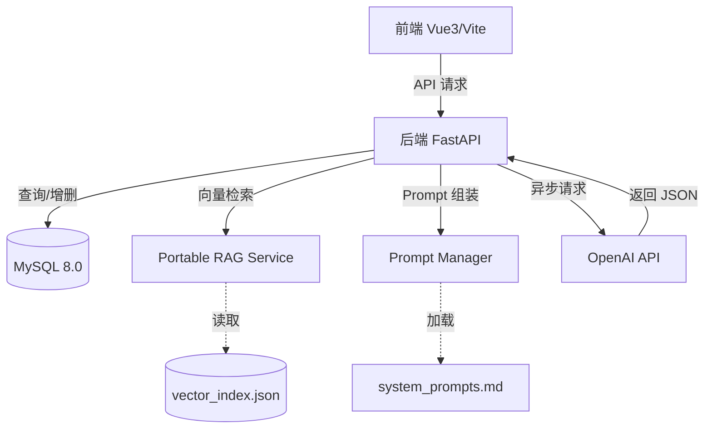

# InterviewEcho 项目工作流详细说明

本文档旨在详细描述 **InterviewEcho** 模拟面试平台的全链路工作机制，涵盖技术底层架构与用户交互流程。

---

## 1. 基础准备阶段 (Setup & Initialization)

在运行项目之前，系统需完成环境初始化以确保 RAG 系统可用。

1.  **数据库初始化**: 通过 `backend/sql/init_db.sql` 在 MySQL 8.0 中创建表结构（用户、面试、消息、评估数据）。
2.  **环境变量配置**: 用户在 `.env` 中填入 `LLM_API_KEY` 和 `DB_PASSWORD`。系统由 `core/config.py` 统筹加载。
3.  **RAG 索引构建 (`build_index.py`)**:
    *   读取 `knowledge-base/` 下的所有 Markdown (知识点) 和 JSON (题库) 文件名。
    *   调用 OpenAI Embeddings 接口将文本转化为向量。
    *   将向量与原始内容持久化至 `backend/rag/vector_index.json`，形成“离线本地知识库”。

---

## 2. 用户访问流 (User Experience Flow)

1.  **身份认证**: 前端 Vue 3 通过 `AuthView.vue` 进行注册/登录，后端 `routers/auth.py` 验证并分发 JWT Token。
2.  **岗位选择 (`DashboardView.vue`)**: 用户进入仪表盘，看到高颜值的岗位卡片（Java、Web、Python）。
3.  **启动面试**: 点击岗位后，前端跳转至 `/interview/:role`，并向后端发送 `/interview/start` 请求。

---

## 3. 模拟面试交互流 (Core Interview Logic)

这是本项目的核心，采用了 **RAG + LLM** 的双动力架构：

1.  **上下文检索 (`services/rag_service.py`)**:
    *   当用户发送回答或 AI 准备提问时，系统会将当前对话语境作为查询词。
    *   通过相似度在 `vector_index.json` 中检索最相关的知识点或往届题目。
2.  **大模型对话 (`core/llm_service.py`)**:
    *   **Prompt 组装**: `PromptManager` 加载 `system_prompts.md` 中的系统预设。
    *   **注入 RAG 背景**: 将检索到的知识点作为“参考资料”注入 Prompt，使 AI 面试官能够提问更深、更专业的细节。
    *   **异步响应**: 使用 `AsyncOpenAI` 异步生成追逐，前端实时展示对话。

---

## 4. 全自动化评估流 (Evaluation & Report)

当用户点击“结束面试”：

1.  **会话总结**: 后端提取该次面试的所有对话历史记录。
2.  **专家评审**: 将对话历史发送给 LLM，要求按固定 JSON 格式打分。
3.  **数据落库**: `routers/interview.py` 将评分存入 `evaluations` 表。
4.  **报告展示 (`ReportView.vue`)**: 展示能力得分、亮点 (Strengths) 与 待改进点 (Weaknesses)。

---

## 5. 项目架构图

